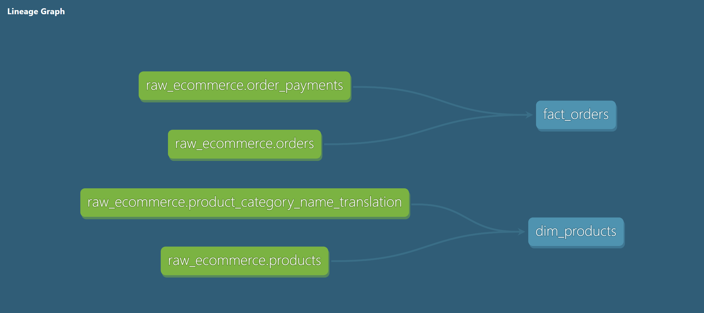
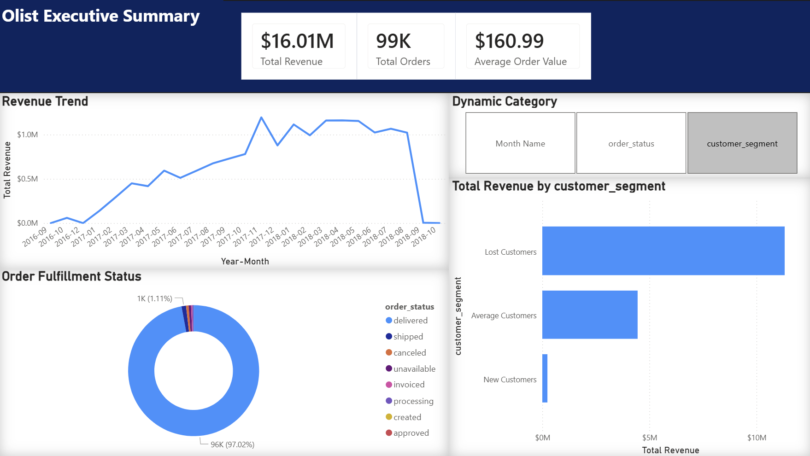
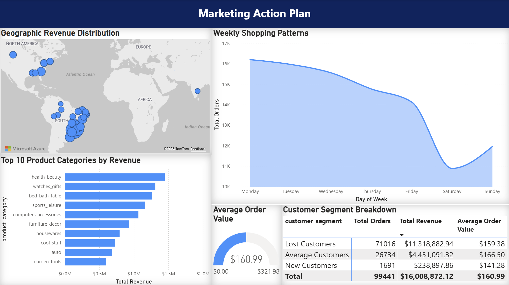
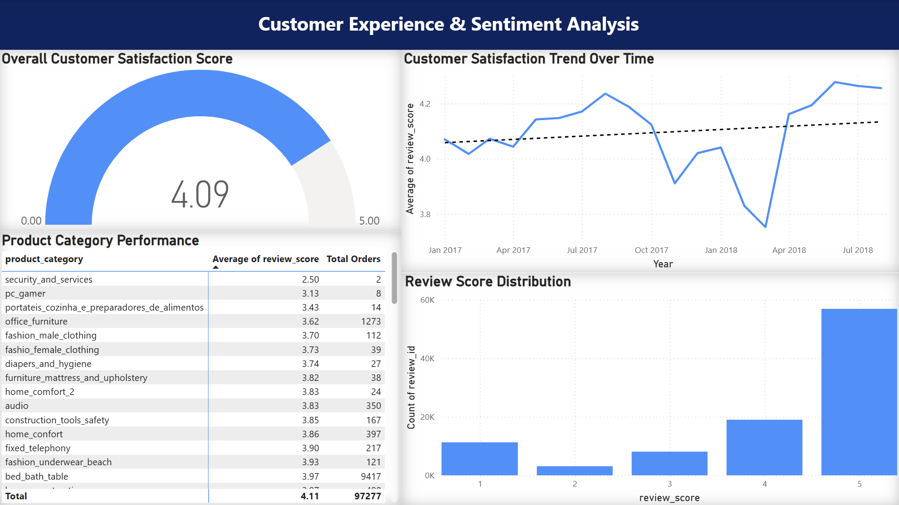

# 🛒 Olist E-Commerce Analytics Pipeline & Executive Dashboard

## 📌 Executive Summary
This project is an end-to-end analytics engineering solution built for Olist, the largest department store in Brazilian marketplaces. Moving beyond basic data visualization, this project implements a complete ELT (Extract, Load, Transform) pipeline to convert over 1.4 million raw records across 9 datasets into a production-ready Star Schema, culminating in an interactive, 3-page Power BI application designed for executive decision-making.

## 🛠️ Technology Stack
* **Language & Extraction:** Python, Pandas, Jupyter Notebooks
* **Cloud Data Warehouse:** Google BigQuery
* **Data Transformation & Modeling:** dbt (data build tool)
* **Business Intelligence:** Microsoft Power BI

---

## 🏗️ Architecture & Data Pipeline

### 1. Python Extraction & Cloud Loading (`01_extract_and_load.ipynb`)
The pipeline begins with a Python script that loads 9 raw CSV datasets (99,441 orders, 99,441 customers, 112,650 order items, 1,000,163 geolocation records, and more) into Google BigQuery's `raw_data` staging dataset using the Google Cloud BigQuery API and PyArrow for efficient columnar serialization.

### 2. dbt Transformation & DAG
Once in BigQuery, **dbt** handles all transformations — cleaning data, casting timestamps, joining disparate raw tables, and computing RFM segmentation entirely in SQL. The result is a clean `analytics_dev` presentation layer ready for BI consumption.

*Below is the DAG (Directed Acyclic Graph) showing the full data lineage from raw sources to final analytical models:*



### 3. Dimensional Modeling (Star Schema)
The BigQuery presentation layer is structured into a strict Star Schema to ensure fast cross-filtering in Power BI:
* **Fact Tables:** `fact_orders`, `fact_reviews`
* **Dimension Tables:** `dim_customers`, `dim_products`, `dim_order_items`
* **Segmentation Model:** `rfm_segmentation` (built on top of `fact_orders` via `{{ ref() }}`)

`dim_products` joins the raw products table with the category translation table to convert all Portuguese category names to English using `COALESCE` for untranslated edge cases. `fact_reviews` carries `product_category` through an `order_items` bridge join, ensuring the BI layer never touches raw data directly.

---

## 📊 Dashboard Previews & Key Insights

### Page 1: Executive KPI Summary
*(Designed for C-Suite quick-glance health checks)*

* **Insight:** Built an RFM (Recency, Frequency, Monetary) segmentation model in dbt to classify customers into New, Average, Lost, At Risk, and Champions segments. Recency is measured against the most recent order in the dataset rather than today's date, which is the correct approach for historical datasets. Revenue is heavily concentrated in the Lost segment because this is a 2016–2018 dataset — most customers appear "lost" due to data recency, not actual churn.

### Page 2: Marketing Action Plan
*(Designed for the Director of Marketing & Regional Managers)*

* **Insight:** Geospatial analysis revealed high revenue concentration in southeastern Brazilian states (SP, RJ, MG). Cross-filtering with the weekly shopping pattern chart shows a consistent order volume drop on weekends, indicating that promotional ad spend should be weighted toward Monday–Wednesday in these specific regions.

### Page 3: Customer Experience & Sentiment Analysis
*(Designed for the Head of Customer Success)*

* **Insight:** The historical trendline reveals a severe satisfaction drop between November 2017 and February 2018, correlating directly with Black Friday and holiday order surges — highlighting a supply-chain bottleneck during peak seasons. The dbt trendline overlay confirms a recovery and upward trajectory through mid-2018.

---

## 🚀 How to Run Locally

### Prerequisites
Install all dependencies:
```bash
pip install -r requirements.txt
```

### GCP Credentials
Create a Service Account in Google Cloud Console, download the JSON key, and place it in the project root as `credentials.json`. This file is already excluded via `.gitignore` and should never be committed.

### Dataset
Download the [Olist Brazilian E-Commerce dataset from Kaggle](https://www.kaggle.com/datasets/olistbr/brazilian-ecommerce) and place all CSV files inside a `/data` folder in the project root.

### Steps
1. Clone this repository.
2. Add `credentials.json` and the `/data` folder as described above.
3. Run `01_extract_and_load.ipynb` to load all 9 raw tables into BigQuery.
4. Navigate to the dbt project and run the models:
```bash
cd olist_transformations
dbt run
```
5. Open `Olist_Executive_Dashboard.pbix` in Power BI Desktop and click **Home → Refresh** to connect to your BigQuery instance.

---

## 📁 Repository Structure
```
olist-elt-pipeline-powerbi/
├── 01_extract_and_load.ipynb     # Python ELT script
├── olist_transformations/        # dbt project
│   └── models/
│       ├── dim_customers.sql
│       ├── dim_order_items.sql
│       ├── dim_products.sql      # Includes Portuguese → English translation
│       ├── fact_orders.sql
│       ├── fact_reviews.sql      # Includes product_category via bridge join
│       ├── rfm_segmentation.sql  # Built on fact_orders via ref()
│       ├── schema.yml
│       └── sources.yml
├── Olist_Executive_Dashboard.pbix
├── requirements.txt
├── dbt_lineage.png
├── page1.png
├── page2.png
└── page3.png
```

---

**About the Author:** Rahul Manohar Durshinapally — Master of Science in Information Systems, Northeastern University
